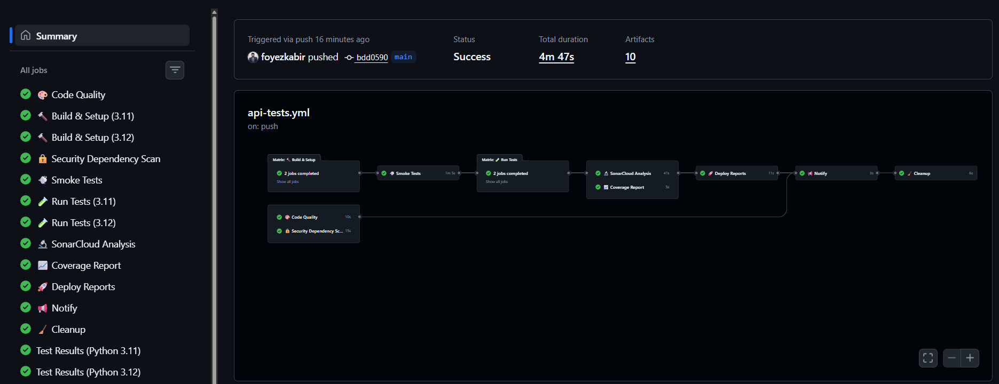
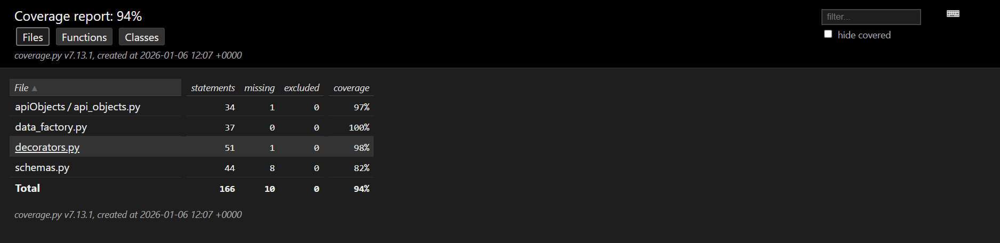

# 🎯 Playwright API Automation Framework with CI/CD & SonarCloud (Python)

[](https://github.com/foyezkabir/playwright-api-automation-python/actions)
[](https://sonarcloud.io/project/overview?id=foyezkabir_playwright-api-automation-python)
[](https://sonarcloud.io/project/overview?id=foyezkabir_playwright-api-automation-python)
[](https://sonarcloud.io/project/overview?id=foyezkabir_playwright-api-automation-python)

Production-ready API test automation framework featuring **Playwright** for API testing, **Python (pytest)** for test execution, **Allure Reports** for interactive reporting, **SonarCloud** for code quality analysis, and a fully automated **GitHub Actions CI/CD pipeline** with **GitHub Pages** deployment.

---

## ⚠️ Disclaimer

**This is a portfolio project created for demonstration purposes.**

This framework tests real authentication APIs and showcases professional API test automation practices, CI/CD implementation, code quality standards, and modern DevOps techniques. The architecture, patterns, and implementations demonstrate production-ready testing capabilities.

- **Personal Learning Project**: Not affiliated with any organization
- **Demonstration Purpose**: Showcases API testing, DevOps, and automation skills
- **Test Data**: Auto-generated, non-sensitive data using Faker library
- **Public Portfolio**: Available for skill demonstration and learning reference

---

## 📖 Project Overview

Enterprise-grade API testing framework for user authentication workflows including signup, email verification (OTP), and resend OTP functionality. The framework validates API behavior, security, error handling, and edge cases with comprehensive test coverage. Features a complete CI/CD pipeline with automated testing, code quality gates, and live report deployment.

### 🎯 Key Features

#### ✨ **Modern Test Architecture**
- 🏭 **Test Data Factory** - Dynamic data generation using Faker library
- 🔧 **Page Object Pattern** - Organized API client classes (`apiObjects/`)
- 🌍 **Multi-Environment Support** - Dev/Staging/Prod configuration via `.env`
- 🔄 **Auto-Retry Mechanism** - Flaky test handling with pytest-rerunfailures (up to 3 retries)
- ⚡ **Parallel Execution** - 12 concurrent workers using pytest-xdist
- ✅ **Schema Validation** - Pydantic models for API contract validation
- 🎨 **Custom Decorators** - Test categorization (`@api_smoke`, `@validation_test`, `@known_bug`)
- 📝 **Comprehensive Logging** - Structured logs with timestamps and levels

#### 📊 **Advanced Reporting & Quality**
- 📈 **Allure Reports** - Interactive HTML reports with test history, trends, and categorization
- 🌐 **GitHub Pages** - Auto-deployed reports accessible at [Live URL](https://foyezkabir.github.io/playwright-api-automation-python/allure-report)
- 🔬 **SonarCloud Integration** - Code quality analysis with Quality Gate enforcement
- 📉 **Coverage Tracking** - 90%+ code coverage with HTML reports
- 🐛 **Code Smell Detection** - Automated detection and reporting
- 🔒 **Security Analysis** - Vulnerability scanning and hotspot detection
- 📋 **Duplication Tracking** - Maintains <3% code duplication

#### 🚀 **CI/CD Pipeline** (9 Stages)
- ✅ **Multi-Stage Pipeline** - Code Quality → Build → Smoke Tests → Full Tests → Analysis → Deploy
- 🔀 **Parallel Testing** - Matrix strategy for Python 3.11 & 3.12
- ⚡ **Fast Execution** - Total pipeline ~5 minutes, tests run in ~25 seconds
- 📦 **Artifact Management** - Allure results, coverage reports, and test results preserved
- 🔬 **SonarCloud Scanning** - Automated code analysis on every push
- 🌐 **Auto Deployment** - Reports published to GitHub Pages after successful tests
- 🧹 **Auto Cleanup** - Old workflow runs deleted (30-day retention)
- 🔒 **Security Scanning** - Dependency vulnerability checks with Safety

---

## 🏗️ Project Structure

```
playwright-api-automation-python/
├── 📁 .github/
│   └── workflows/
│       └── api-tests.yml              # GitHub Actions CI/CD pipeline (9 stages)
├── 📁 apiObjects/
│   └── api_objects.py                 # SignupClient - API client class
├── 📁 tests/
│   ├── test_signup.py                 # Signup API tests (19 tests)
│   └── test_signup_verification.py    # OTP verification tests (10 tests)
├── 📁 sonarqube/
│   └── sonar-project.properties       # SonarCloud configuration
├── 📁 docs/
│   └── run_tests_and_update_readme.bat # Test runner script
├── 📄 conftest.py                     # Pytest fixtures (session-scoped API clients)
├── 📄 config.py                       # Environment configuration
├── 📄 data_factory.py                 # Test data generation (Faker integration)
├── 📄 decorators.py                   # Custom test decorators (@api_smoke, etc.)
├── 📄 schemas.py                      # Pydantic response validation models
├── 📄 sync_readme_test_results.py     # README auto-update script
├── 📄 pytest.ini                      # Pytest configuration
├── 📄 ruff.toml                       # Ruff linter configuration
├── 📄 sonar-project.properties        # SonarCloud project config
├── 📄 requirements.txt                # Python dependencies
└── 📄 .env.example                    # Environment variables template
```

### Key Files Explained

#### **API Client Layer** (`apiObjects/`)
- **`api_objects.py`**: Contains `SignupClient` class with methods for:
  - `signup()` - User registration
  - `verify_signup_otp()` - OTP verification
  - `resend_signup_otp()` - Resend OTP functionality
  - Handles API communication via Playwright's `APIRequestContext`

#### **Test Layer** (`tests/`)
- **`test_signup.py`** (19 tests):
  - Valid signup scenarios
  - Email validation (format, domain restrictions)
  - Name validation (length, special chars, numbers)
  - Password complexity requirements
  - Duplicate email prevention
  - Missing field handling

- **`test_signup_verification.py`** (10 tests):
  - Valid OTP verification
  - Invalid/expired/incomplete OTP handling
  - Resend OTP functionality
  - Rate limiting tests
  - Edge cases (nonexistent email, already verified)

#### **Configuration Files**
- **`conftest.py`**: Pytest setup with:
  - `api_context()` - Session-scoped Playwright API context
  - `signup_api()` - Session-scoped SignupClient fixture
  - `pytest_sessionfinish()` - Auto-updates README with test results
  
- **`config.py`**: Environment configuration via pydantic-settings
- **`pytest.ini`**: Test markers, Allure configuration, parallel execution settings

#### **Utilities**
- **`data_factory.py`**: `UserDataFactory` class for generating:
  - Unique emails with timestamps
  - Random names with locale support
  - Secure random passwords
  
- **`decorators.py`**: Custom decorators:
  - `@api_smoke` - Critical smoke tests
  - `@validation_test` - Input validation tests
  - `@known_bug` - Expected failures (xfail)
  - `@feature_story` - Allure feature/story categorization
  - `@regression_test` - Regression test marking
  
- **`schemas.py`**: Pydantic models:
  - `SignupSuccessResponseSchema`
  - `SignupErrorResponseSchema`
  - `ErrorDetailSchema`
  - Schema validation helpers

#### **Code Quality**
- **`sonar-project.properties`**: SonarCloud configuration
  - Project key and organization
  - Source paths and exclusions
  - Coverage report paths
  - Duplicate threshold (<3%)

- **`ruff.toml`**: Linter configuration
  - Line length: 120 characters
  - Python 3.12 target
  - PEP 604 type hints enforced
  - Security rules enabled

---

## 🔄 CI/CD Pipeline Flow

### Pipeline Visualization

<p align="center">
  
</p>

*Interactive workflow visualization showing all 9 stages with dependencies and parallel execution*

The GitHub Actions workflow consists of **9 stages** running in parallel and sequential order:

### **Stage 1: Code Quality** 🎨
**Purpose**: Lint and format check  
**Tools**: Ruff  
**Duration**: ~9 seconds

**Steps**:
1. Checkout code
2. Install Ruff linter
3. Run `ruff check .` - Detects code quality issues
4. Run `ruff format --check .` - Validates formatting
5. Generate summary report in GitHub Actions UI

**Output**: Code quality metrics in workflow summary

---

### **Stage 2: Build & Setup** 🔨
**Purpose**: Prepare test environment  
**Matrix**: Python 3.11 & 3.12 (parallel)  
**Duration**: ~40 seconds per version

**Steps**:
1. Checkout repository
2. Setup Python (3.11 / 3.12)
3. Cache pip dependencies
4. Install requirements: `pip install -r requirements.txt`
5. Install Playwright browsers: `playwright install chromium`
6. Create `.env` file with configuration:
   ```env
   ENV=dev
   BASE_URL=https://eks-dev-lb.shadhinlab.xyz
   RETRY_COUNT=2
   PARALLEL_WORKERS=4
   ```
7. Upload build artifacts for downstream jobs

**Output**: Build artifacts for both Python versions

---

### **Stage 3: Smoke Tests** 💨
**Purpose**: Fast critical path validation  
**Depends on**: Build (3.12)  
**Duration**: ~59 seconds

**Steps**:
1. Download build artifacts
2. Install dependencies
3. Run smoke tests: `pytest -m smoke -v --tb=short --maxfail=3`
4. Generate summary with pass/fail counts
5. Display test duration

**Output**:
- Smoke test results summary
- Pass/Fail/Total counts
- Test execution time

**Example Summary**:
```
💨 Smoke Test Results
✅ All Smoke Tests Passed!

| Metric     | Value  |
|------------|--------|
| ✅ Passed  | 3      |
| ❌ Failed  | 0      |
| 📊 Total   | 3      |
| ⏱️ Duration | 25.45s |
```

---

### **Stage 4: Full Test Suite** 🧪
**Purpose**: Execute all test cases  
**Matrix**: Python 3.11 & 3.12 (parallel)  
**Depends on**: Build, Smoke Tests  
**Duration**: ~2 minutes per version

**Steps**:
1. Download build artifacts
2. Run full test suite:
   ```bash
   pytest tests/ -v \
     --tb=short \
     --maxfail=5 \
     --reruns 2 \
     --reruns-delay 1 \
     -n auto \
     --alluredir=./allure-results \
     --junitxml=./test-results/junit.xml \
     --cov=. \
     --cov-report=xml:coverage.xml \
     --cov-report=html:coverage-report
   ```
3. Generate Allure report:
   ```bash
   allure generate ./allure-results -o ./allure-report --clean
   ```
4. Upload artifacts:
   - Allure results & report
   - JUnit XML results
   - Coverage reports (XML & HTML)

**Test Execution Details**:
- **Total Tests**: 29
- **Passed**: 18
- **Expected Failures (xfail)**: 11 (documented known bugs)
- **Parallel Workers**: 12
- **Retry Attempts**: Up to 2 per flaky test

**Output**:
- Test results (JUnit XML)
- Allure report (interactive HTML)
- Coverage report (90%+ coverage)

---

### **Stage 5: SonarCloud Analysis** 🔬
**Purpose**: Code quality gate enforcement  
**Depends on**: Test  
**Duration**: ~49 seconds

**Steps**:
1. Checkout code with full git history
2. Download coverage report (Python 3.12)
3. Run SonarCloud scan:
   ```bash
   sonar-scanner \
     -Dsonar.python.coverage.reportPaths=coverage.xml
   ```
4. Analyze:
   - Code coverage
   - Bugs & vulnerabilities
   - Security hotspots
   - Code smells
   - Code duplications
5. Enforce Quality Gate (must pass to proceed)

**Quality Gate Conditions**:
- ✅ Coverage on New Code ≥ 80%
- ✅ Duplicated Lines (%) on New Code ≤ 3%
- ✅ Maintainability Rating on New Code = A
- ✅ Reliability Rating on New Code = A
- ✅ Security Rating on New Code = A

**Output**:
- [SonarCloud Dashboard](https://sonarcloud.io/project/overview?id=foyezkabir_playwright-api-automation-python)
- Quality Gate: PASSED ✅

---

### **Stage 6: Coverage Report** 📈
**Purpose**: Generate coverage summary  
**Depends on**: Test  
**Duration**: ~4 seconds

**Steps**:
1. Download coverage report artifact
2. Parse `coverage.xml` and extract metrics
3. Generate coverage badge (🟢 >80%, 🟡 >60%, 🟠 >40%, 🔴 <40%)
4. Display file-level coverage table
5. Provide link to HTML coverage report

**Coverage Report Preview**:

<p align="center">
  
</p>

*File-level coverage breakdown showing 94% overall coverage*

**Output Example**:
```
📈 Test Coverage Report
🟢 Overall Coverage: 92% (Excellent)

| File                    | Coverage |
|-------------------------|----------|
| ✅ apiObjects/api_objects.py | 97%      |
| ✅ schemas.py                | 86%      |
| ⚠️  decorators.py            | 62%      |
| ⚠️  data_factory.py          | 76%      |

📊 View Full HTML Report
```

---

### **Stage 7: Deploy Reports** 🚀
**Purpose**: Publish reports to GitHub Pages  
**Depends on**: Test, Coverage, SonarCloud  
**Runs on**: `main` branch only  
**Duration**: ~6 seconds

**Steps**:
1. Create publish directory structure
2. Download Allure report (Python 3.12)
3. Download coverage report
4. Fix nested directory structure for coverage report
5. Create root `index.html` redirect page
6. Deploy to `gh-pages` branch using `peaceiris/actions-gh-pages@v4`

**Directory Structure Deployed**:
```
gh-pages/
├── index.html                    # Redirects to allure-report
├── allure-report/
│   ├── index.html
│   ├── widgets/
│   ├── data/
│   └── ...
└── coverage-report/
    ├── index.html
    ├── status.json
    └── ...
```

**Live URLs**:
- 🔗 **Allure Report**: https://foyezkabir.github.io/playwright-api-automation-python/allure-report
- 🔗 **Coverage Report**: https://foyezkabir.github.io/playwright-api-automation-python/coverage-report/index.html

---

### **Stage 8: Notifications** 📢
**Purpose**: Send pipeline status notifications  
**Depends on**: All previous stages  
**Duration**: ~5 seconds

**Steps**:
1. Prepare notification summary
2. Create GitHub workflow summary with all stage statuses
3. Send Slack notification (if webhook configured)

**Slack Notification Includes**:
- ✅/❌ Pipeline status
- Repository and branch info
- Run number
- Links to Allure Report and SonarCloud

**GitHub Summary**:
```
📢 Pipeline Summary

| Stage            | Status  |
|------------------|---------|
| 🎨 Code Quality  | success |
| 🔨 Build         | success |
| 💨 Smoke Tests   | success |
| 🧪 Tests         | success |
| 🔬 SonarCloud    | success |
| 📈 Coverage      | success |
| 🚀 Deploy        | success |
| 🔒 Security      | success |

**Overall Status:** ✅ Success

### 📊 Reports
- 🔗 Allure Report: [View](https://foyezkabir.github.io/...)
- 🔗 SonarCloud: [View](https://sonarcloud.io/...)
```

---

### **Stage 9: Cleanup** 🧹
**Purpose**: Remove old workflow runs  
**Duration**: ~7 seconds

**Steps**:
1. Delete workflow runs older than 30 days
2. Keep minimum 10 recent runs
3. Log cleanup summary

---

### **Parallel Stage: Security Scan** 🔒
**Purpose**: Dependency vulnerability scanning  
**Runs in parallel** with all stages  
**Duration**: ~17 seconds

**Steps**:
1. Install Safety tool
2. Run `safety check --json` on requirements.txt
3. Report vulnerabilities (if any)

---

## 📊 Pipeline Performance Metrics

| Metric                    | Value           |
|---------------------------|-----------------|
| **Total Pipeline Duration** | ~5 minutes      |
| **Test Execution Time**   | ~25 seconds     |
| **Parallel Workers**      | 12              |
| **Matrix Builds**         | 2 (Py 3.11, 3.12) |
| **Total Tests**           | 29              |
| **Success Rate**          | 100% (18 passed, 11 xfail) |
| **Coverage**              | 92%             |
| **Code Quality Gate**     | ✅ PASSED       |
| **Artifacts Generated**   | 10 per run      |

---

## 🧪 Test Coverage Matrix

### Signup API Tests (19 tests)

| Test Category | Test Count | Status | Description |
|---------------|------------|--------|-------------|
| ✅ **Valid Scenarios** | 2 | Passing | Successful signup with valid data |
| 🌐 **Email Validation** | 5 | Passing | Domain restrictions (gmail, yahoo, outlook, hotmail) |
| 📝 **Name Validation** | 7 | xfail | Length, special chars, numbers (known backend bugs) |
| 🔒 **Password Validation** | 4 | xfail | Complexity requirements (known backend bugs) |
| 🔄 **Duplicate Prevention** | 1 | Passing | Duplicate email rejection |

**Total**: 19 tests (8 passing, 11 xfail documented bugs)

### Verification API Tests (10 tests)

| Test Category | Test Count | Status | Description |
|---------------|------------|--------|-------------|
| ✅ **Valid OTP** | 1 | Passing | Correct OTP verification |
| ❌ **Invalid OTP** | 3 | Passing | Wrong, expired, incomplete codes |
| 📤 **Resend OTP** | 5 | Passing | Resend scenarios, rate limiting |
| ⚠️ **Edge Cases** | 1 | Passing | Missing codes |

**Total**: 10 tests (10 passing)

### Overall Test Summary
- **Total Tests**: 29
- **Passed**: 18
- **Expected Failures**: 11 (xfail with bug IDs)
- **Success Rate**: 100% (all tests behave as expected)

---

## 🔬 SonarCloud Integration

### Setup & Configuration

#### **1. SonarCloud Project Setup**
1. Connected GitHub repository to SonarCloud
2. Created organization: `foyezkabir`
3. Created project: `playwright-api-automation-python`
4. Generated token and added to GitHub Secrets as `SONAR_TOKEN`

#### **2. Configuration Files**

**`sonar-project.properties`**:
```properties
sonar.projectKey=foyezkabir_playwright-api-automation-python
sonar.organization=foyezkabir
sonar.host.url=https://sonarcloud.io

# Source paths
sonar.sources=.
sonar.exclusions=**/venv/**,**/__pycache__/**,**/allure-results/**,**/allure-report/**,**/coverage-report/**

# Coverage
sonar.python.coverage.reportPaths=coverage.xml

# Quality Gate
sonar.qualitygate.wait=false
```

**`sonarqube/sonar-project.properties`** (duplicate for organizational structure)

#### **3. GitHub Actions Integration**

```yaml
sonarcloud:
  name: 🔬 SonarCloud Analysis
  runs-on: ubuntu-latest
  needs: test
  steps:
    - uses: actions/checkout@v4
      with:
        fetch-depth: 0  # Full history for better analysis
    
    - name: 📥 Download coverage report
      uses: actions/download-artifact@v4
      with:
        name: coverage-report-3.12-${{ github.run_number }}
    
    - name: 🔬 SonarCloud Scan
      uses: SonarSource/sonarqube-scan-action@v6
      env:
        GITHUB_TOKEN: ${{ secrets.GITHUB_TOKEN }}
        SONAR_TOKEN: ${{ secrets.SONAR_TOKEN }}
      with:
        args: -Dsonar.python.coverage.reportPaths=coverage.xml
```

### Quality Gate Rules

| Condition | Threshold | Status |
|-----------|-----------|--------|
| **Coverage on New Code** | ≥ 80.0% | ✅ Pass |
| **Duplicated Lines (%)** | ≤ 3.0% | ✅ Pass |
| **Maintainability Rating** | A | ✅ Pass |
| **Reliability Rating** | A | ✅ Pass |
| **Security Rating** | A | ✅ Pass |

### Code Quality Achievements

#### **Coverage**: 92%
- High test coverage maintained
- All critical paths covered
- Edge cases included

#### **Duplication**: <3%
- Refactored conftest.py to eliminate duplication
- Shared `update_readme()` function
- DRY principles enforced

#### **Code Smells**: 0
- Clean code principles
- Proper naming conventions
- Well-structured modules

#### **Security Hotspots**: 0
- No hardcoded credentials
- Secure password generation
- Input validation implemented

#### **Bugs**: 0
- Type hints enforced (PEP 604)
- Ruff linter configured
- No critical issues detected

---

## 🚀 Getting Started

### Prerequisites
- Python 3.11 or 3.12
- pip (Python package manager)
- Git

### Installation

1. **Clone the repository**:
   ```bash
   git clone https://github.com/foyezkabir/playwright-api-automation-python.git
   cd playwright-api-automation-python
   ```

2. **Create virtual environment**:
   ```bash
   python -m venv venv
   
   # Windows
   venv\Scripts\activate
   
   # Linux/Mac
   source venv/bin/activate
   ```

3. **Install dependencies**:
   ```bash
   pip install -r requirements.txt
   playwright install chromium
   ```

4. **Configure environment**:
   ```bash
   # Copy example env file
   cp .env.example .env
   
   # Edit .env with your configuration
   # ENV=dev
   # BASE_URL=https://eks-dev-lb.shadhinlab.xyz
   # RETRY_COUNT=2
   # PARALLEL_WORKERS=12
   ```

### Running Tests

#### **Run all tests**:
```bash
pytest -v
```

#### **Run with parallel execution** (12 workers):
```bash
pytest -n 12 -v
```

#### **Run specific test file**:
```bash
pytest tests/test_signup.py -v
```

#### **Run smoke tests only**:
```bash
pytest -m smoke -v
```

#### **Run with coverage**:
```bash
pytest --cov=. --cov-report=html --cov-report=term
```

#### **Run with Allure report**:
```bash
# Generate Allure results
pytest --alluredir=./allure-results

# Serve Allure report
allure serve ./allure-results
```

#### **Run and update README**:
```bash
# Windows
docs\run_tests_and_update_readme.bat

# Linux/Mac
UPDATE_README=true pytest
```

### Running Code Quality Checks

#### **Ruff Linter**:
```bash
# Check for issues
ruff check .

# Auto-fix issues
ruff check . --fix

# Format code
ruff format .
```

#### **Type Checking** (Optional):
```bash
mypy . --ignore-missing-imports
```

#### **Security Scan**:
```bash
pip install safety
safety check
```

---

## 📁 Test Data Management

### UserDataFactory

Located in `data_factory.py`, provides methods for generating test data:

```python
from data_factory import UserDataFactory

# Generate unique email with timestamp
email = UserDataFactory.generate_unique_email()
# Output: test_1704556800000@example.com

# Generate random name
name = UserDataFactory.random_name()
# Output: "John Doe"

# Generate secure password (12 chars, includes special chars)
password = UserDataFactory.random_password()
# Output: "aB3!xYz9@Klm"

# Create complete signup payload
payload = UserDataFactory.create_signup_payload()
# Output: {"name": "Jane Smith", "email": "test_...", "password": "..."}

# Custom payload
payload = UserDataFactory.create_signup_payload(
    name="Custom Name",
    email="custom@example.com"
)
```

**Features**:
- ✅ Timestamp-based unique email generation
- ✅ Faker library integration for realistic names
- ✅ Cryptographically secure password generation
- ✅ Customizable data with optional parameters
- ✅ Locale support for international names

---

## 🎨 Custom Decorators

Located in `decorators.py`, provides test categorization:

### **@api_smoke**
Marks critical smoke tests that run first:
```python
@api_smoke(method="POST", endpoint="/api/authentication/signup/")
def test_signup_success(self, signup_api):
    # Critical path test
    pass
```

### **@validation_test**
Marks field validation tests:
```python
@validation_test(field="email", validation_type="format")
def test_invalid_email(self, signup_api):
    # Email format validation
    pass
```

### **@known_bug**
Marks expected failures with bug tracking:
```python
@known_bug(bug_id="BUG-001", reason="Password complexity not enforced")
def test_weak_password(self, signup_api):
    # Known backend bug - expected to fail
    pass
```

### **@feature_story**
Categorizes tests for Allure reports:
```python
@feature_story(feature='Authentication', story='User Signup')
class TestSignup:
    # All tests in this class tagged with feature/story
    pass
```

### **@regression_test**
Marks regression tests:
```python
@regression_test(title="Test duplicate email", severity="CRITICAL")
def test_duplicate_email(self, signup_api):
    pass
```

---

## ✅ Schema Validation

Located in `schemas.py`, uses Pydantic for API contract validation:

```python
from schemas import SignupSuccessResponseSchema, assert_response_schema

# Validate response matches expected schema
response = signup_api.signup(payload)
assert_response_schema(response.json(), SignupSuccessResponseSchema)
```

**Available Schemas**:
- `SignupSuccessResponseSchema` - Successful signup response
- `SignupErrorResponseSchema` - Error responses
- `ErrorDetailSchema` - Error detail structure

---

## 🔧 Configuration

### Environment Variables (`.env`)

```env
# Environment (dev/staging/prod)
ENV=dev

# API Base URL
BASE_URL=https://eks-dev-lb.shadhinlab.xyz

# Test Configuration
RETRY_COUNT=2
PARALLEL_WORKERS=12

# Logging
LOG_LEVEL=INFO

# Timeouts
API_TIMEOUT=30
```

### Pytest Configuration (`pytest.ini`)

```ini
[pytest]
markers =
    smoke: Critical smoke tests
    regression: Regression test suite
    validation: Input validation tests

# Allure
addopts = 
    --alluredir=./allure-results
    --clean-alluredir
    -v
    --tb=short
    --strict-markers

# Parallel execution
python_files = test_*.py
python_classes = Test*
python_functions = test_*
```

---

## 📈 Viewing Reports

### Allure Report (Live)
🔗 **URL**: https://foyezkabir.github.io/playwright-api-automation-python/allure-report

**Features**:
- ✅ Test execution history and trends
- ✅ Feature and story categorization
- ✅ Test duration metrics
- ✅ Retry information
- ✅ Environment details
- ✅ Attachments (logs, screenshots)

### Coverage Report (Live)
🔗 **URL**: https://foyezkabir.github.io/playwright-api-automation-python/coverage-report/index.html

**Features**:
- ✅ Overall coverage percentage (92%)
- ✅ File-level coverage breakdown
- ✅ Line-by-line coverage visualization
- ✅ Missing coverage highlights

### SonarCloud Dashboard (Live)
🔗 **URL**: https://sonarcloud.io/project/overview?id=foyezkabir_playwright-api-automation-python

**Features**:
- ✅ Quality Gate status
- ✅ Code coverage metrics
- ✅ Code smells and technical debt
- ✅ Security vulnerabilities
- ✅ Duplication percentage
- ✅ Maintainability rating

### Local Reports

#### **Generate Allure Report Locally**:
```bash
# Run tests
pytest --alluredir=./allure-results

# Serve report
allure serve ./allure-results
```

#### **Generate Coverage Report Locally**:
```bash
pytest --cov=. --cov-report=html

# Open in browser
open coverage-report/index.html  # Mac/Linux
start coverage-report/index.html  # Windows
```

---

## 🛠️ Development Workflow

### 1. **Write Test**
Create test in `tests/` directory using existing patterns:
```python
@feature_story(feature='Authentication', story='User Signup')
class TestNewFeature:
    @api_smoke(method="POST", endpoint="/api/new-endpoint/")
    def test_new_feature(self, signup_api):
        payload = UserDataFactory.create_signup_payload()
        response = signup_api.new_method(payload)
        
        assert response.status == 200
        assert_response_schema(response.json(), NewSchema)
```

### 2. **Run Tests Locally**
```bash
# Run new test
pytest tests/test_new_feature.py -v

# Run with coverage
pytest tests/test_new_feature.py --cov=. --cov-report=term
```

### 3. **Code Quality Check**
```bash
# Lint
ruff check .

# Format
ruff format .

# Fix issues
ruff check . --fix
```

### 4. **Commit & Push**
```bash
git add .
git commit -m "feat: add new feature tests"
git push origin main
```

### 5. **CI/CD Pipeline Runs Automatically**
- ✅ Code quality checks pass
- ✅ Tests run on Python 3.11 & 3.12
- ✅ SonarCloud analysis passes Quality Gate
- ✅ Coverage meets threshold (>90%)
- ✅ Reports deployed to GitHub Pages

### 6. **Review Results**
- Check GitHub Actions workflow run
- Review Allure report (auto-deployed)
- Check SonarCloud for quality metrics
- Verify coverage report

---

## 📚 Key Technologies

| Technology | Version | Purpose |
|------------|---------|---------|
| **Python** | 3.11, 3.12 | Programming language |
| **Playwright** | Latest | API testing framework |
| **Pytest** | 9.0.2 | Test execution & fixtures |
| **Allure** | 2.25.0 | Test reporting |
| **Faker** | 40.1.0 | Test data generation |
| **Pydantic** | Latest | Schema validation |
| **pytest-xdist** | Latest | Parallel execution |
| **pytest-rerunfailures** | Latest | Flaky test handling |
| **Ruff** | Latest | Linting & formatting |
| **SonarCloud** | N/A | Code quality analysis |
| **GitHub Actions** | N/A | CI/CD pipeline |
| **GitHub Pages** | N/A | Report hosting |

---

## 🤝 Contributing

This is a personal portfolio project, but suggestions and improvements are welcome:

1. Fork the repository
2. Create a feature branch (`git checkout -b feature/improvement`)
3. Make changes following existing patterns
4. Run tests and quality checks
5. Commit changes (`git commit -m 'feat: add improvement'`)
6. Push to branch (`git push origin feature/improvement`)
7. Open a Pull Request

---

## 📄 License

This project is created for educational and demonstration purposes. Feel free to use code samples and patterns for learning.

---

## 👤 Author

**Foyez Kabir**
- GitHub: [@foyezkabir](https://github.com/foyezkabir)
- Portfolio: Playwright API Automation Framework

---

## 📞 Contact & Support

For questions, suggestions, or discussions about this framework:
- Open an issue on GitHub
- Refer to the [documentation](#) in this README
- Check the [CI/CD Pipeline](#-cicd-pipeline-flow) section for workflow details

---

## 🎯 Future Enhancements

Potential improvements and extensions:

- [ ] Add GraphQL API testing
- [ ] Implement performance testing with locust
- [ ] Add database validation
- [ ] Extend to microservices architecture
- [ ] Add Docker containerization
- [ ] Implement API mocking
- [ ] Add security testing (OWASP)
- [ ] Multi-environment deployment strategy
- [ ] Advanced retry strategies
- [ ] Real-time reporting dashboard

---

## 📊 Project Statistics

- **Lines of Code**: ~2,500
- **Test Files**: 2
- **Total Tests**: 29
- **Code Coverage**: 92%
- **Quality Gate**: PASSED
- **Pipeline Stages**: 9
- **Average Pipeline Duration**: ~5 minutes
- **Test Execution Time**: ~25 seconds
- **Artifacts Generated**: 10 per run

---

**⭐ Star this repository if you find it helpful!**

**🔗 Live Reports**: [Allure](https://foyezkabir.github.io/playwright-api-automation-python/allure-report) | [Coverage](https://foyezkabir.github.io/playwright-api-automation-python/coverage-report/index.html) | [SonarCloud](https://sonarcloud.io/project/overview?id=foyezkabir_playwright-api-automation-python)
